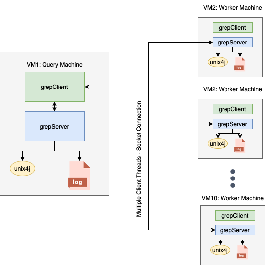

# Distributed Grep Query System

The distributed grep system is designed with 2 major modules in each machine - a server and a client module. When querying from any machine the client module is used - it obtains the grep command, contains network configuration information of the other VMs (hostnames, ports, filepaths) and spawns a thread for N servers to distribute the input command via a socket connection. The individual remote (and local) server(s) wait till a command is received and run the grep command locally with the unix4j library. The result is then sent back via the same socket as the response which the client thread prints before it terminates.The main thread waits for a  volatile static variable to collect line counts from each thread (machine) to print the total line count at the end before the main thread terminates.



## Folder structure

```
.
├── src/
│   ├── main/
│   │   ├── java/<...> (App code folder)
│   │   └── resources/ (config like log4j2.xml goes here)
│   └── test/ (unit tests should go here)
├── target/ (this is the build folder, contains the target JAR file of the application)
│   └── dependency/ (contains jar dependencies that are needed to run the application)
└── pom.xml (manifest/configuration of the maven project)
```

## Grep Server

Server program that is up and running in all the VMs and listens for grep commands sent from a remote (or local) client. Uses Unix4j to grep pattern from the local log file.

### Building the Server Module

Execute the following steps in sequence for a new, clean build
```
$ mvn clean install
$ mvn dependency:copy-dependencies
```
A target directory with jar files for the module and its dependencies is created. 

Now move the log files and the target directory of the server module to each VM using setup-logs.sh from the root directory. Change the file path, netid and VM host addresses accordingly.

```
$ ./setup-logs.sh
$ ./setup-server.sh <VM Number>
```

To run the server on a local machine, execute
```
$ java -cp "target/grepservermp-1.0-SNAPSHOT.jar:target/dependency/*" com.grepservermp.app.App *portnumber*
```

## Grep Client

Client program for obtaining grep command, spawning threads and collecting responses for simultaneous querying of remote and local log files.

### Building the Client Module
```
$ mvn clean install
$ mvn dependency:copy-dependencies
```

On compilation use the scp command as below with apt netid and vm address to move the client target directories to the VMs.

```
$ scp -r ${path_to_client_target_dir} "{vm}:/home/{netid}/"
```

Modify [networkConfig](./grep-client/src/networkConfig.properties) with correct and required addresses, ports and file paths.

SSH into any of the VMs to use as the client machine and run the client program like below (XX -> 01 to 10). Enter the grep command when prompted.

```
$ ssh netid@fa22-cs425-65XX.cs.illinois.edu
$ java -cp "target/grepmp-1.0-SNAPSHOT.jar:target/dependency/*" com.grepmp.app.App
```


### Unit tests

Unit tests are executed during build time for each module, and have been written using JUnit. Most of the test cases are validation based, and check for whether a specific output is generated as part of the grep command input provided. Each module has separate unit tests, and we have also implemented two distributed unit tests that exercise the whole end-to-end connection flow. The first unit test verifies whether the client-server connection is established, and that data is received back from the server by the client. The second unit test covers the output validation portion, and compares the grep output when run on a single machine against the consolidated output received by the client from across all machines.
